# Business Ops OS: workflows and state machines

One diagram per status column that has rules. The rules (guards, reasons, actors) are in `docs/ALGORITHMS.md`; this file only shows the legal moves. Labels in brackets are the authority or condition. "Reason" means a reason is required. Anything not drawn is illegal and answers 409 `INVALID_STATE_TRANSITION` (a missing reason answers 400). Nothing here is Deployed.

## Admissions

### Admission case (A-03, `domain/pipeline.ts`)
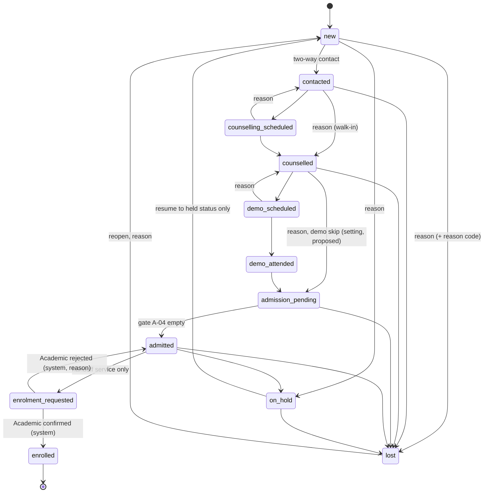
```mermaid
stateDiagram-v2
  [*] --> new
  new --> contacted: two-way contact
  contacted --> counselling_scheduled
  contacted --> counselled: reason (walk-in)
  counselling_scheduled --> counselled
  counselling_scheduled --> contacted: reason
  counselled --> demo_scheduled
  counselled --> admission_pending: reason, demo skip (setting, proposed)
  demo_scheduled --> demo_attended
  demo_scheduled --> counselled: reason
  demo_attended --> admission_pending
  admission_pending --> admitted: gate A-04 empty
  admitted --> enrolment_requested: handoff service only
  enrolment_requested --> enrolled: Academic confirmed (system)
  enrolment_requested --> admitted: Academic rejected (system, reason)
  new --> lost: reason (+ reason code)
  contacted --> lost
  counselled --> lost
  admission_pending --> lost
  admitted --> lost
  new --> on_hold: reason
  admitted --> on_hold
  on_hold --> new: resume to held status only
  on_hold --> lost
  lost --> new: reopen, reason
  enrolled --> [*]
```
Every non-terminal status from `new` to `admitted` can go to `lost` or `on_hold`; only the sources above are drawn once. `enrolment_requested` cannot be lost or held. Lifecycle names used in the brief map onto these statuses (see `requirements/REQUIREMENTS.md`, OPS-070).

### Enrolment handoff attempt (A-19, table `enrolment_attempts`)
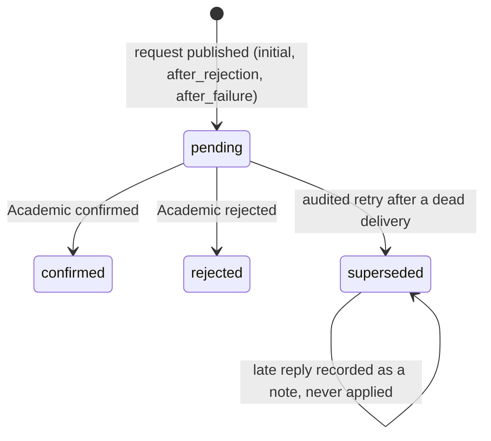
```mermaid
stateDiagram-v2
  [*] --> pending: request published (initial, after_rejection, after_failure)
  pending --> confirmed: Academic confirmed
  pending --> rejected: Academic rejected
  pending --> superseded: audited retry after a dead delivery
  superseded --> superseded: late reply recorded as a note, never applied
```
A new attempt is allowed only when the earlier request can no longer create an enrolment: Academic rejected it, or its delivery is `dead` (reason required). It is refused while the delivery is missing, `failed` (Academic retries) or `processed` (apply the reply). A late confirmation of a superseded attempt notifies operations managers.

### Fee record (A-17, table `fee_records`)
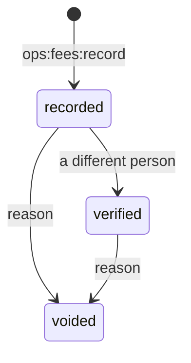
```mermaid
stateDiagram-v2
  [*] --> recorded: ops:fees:record
  recorded --> verified: a different person
  recorded --> voided: reason
  verified --> voided: reason
```
Verified and voided are final. Entries are manual records, never verified payments.

## HR records

### Employment status (A-22)
```mermaid
stateDiagram-v2
  [*] --> onboarding
  onboarding --> active: onboarding approved
  onboarding --> separated: reason, end date
  active --> on_notice: separation approved
  active --> separated: reason, end date
  on_notice --> active: retracted before it applies
  on_notice --> separated: last working day passed
  separated --> [*]: final; a re-hire is a new record
```
Reason always required; nobody changes their own status.

### Compensation record (A-26, table `compensation_records`)
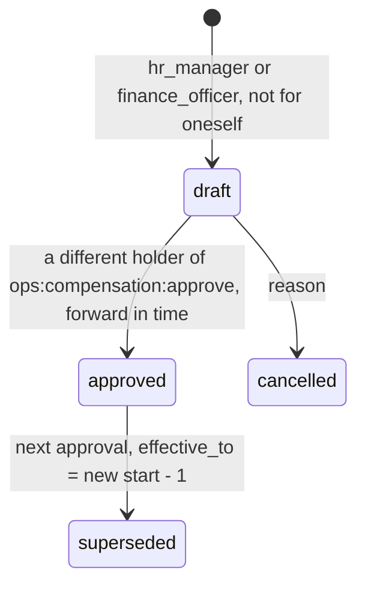
```mermaid
stateDiagram-v2
  [*] --> draft: hr_manager or finance_officer, not for oneself
  draft --> approved: a different holder of ops:compensation:approve, forward in time
  draft --> cancelled: reason
  approved --> superseded: next approval, effective_to = new start - 1
```
At most one `approved` record per employee. Approval needs `confirm: true`.

### Employee document (A-25, table `employee_documents`)
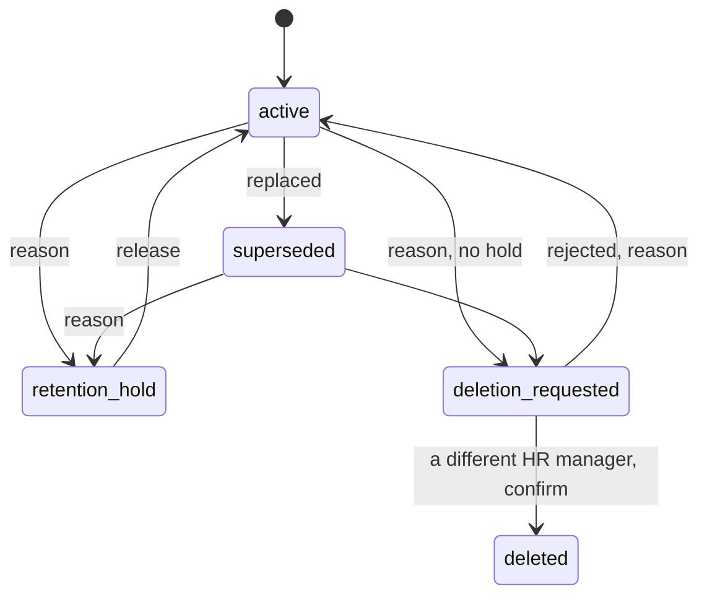
```mermaid
stateDiagram-v2
  [*] --> active
  active --> superseded: replaced
  active --> retention_hold: reason
  superseded --> retention_hold: reason
  retention_hold --> active: release
  active --> deletion_requested: reason, no hold
  superseded --> deletion_requested
  deletion_requested --> deleted: a different HR manager, confirm
  deletion_requested --> active: rejected, reason
```
A deleted document keeps its metadata row; downloads answer 409.

### Asset
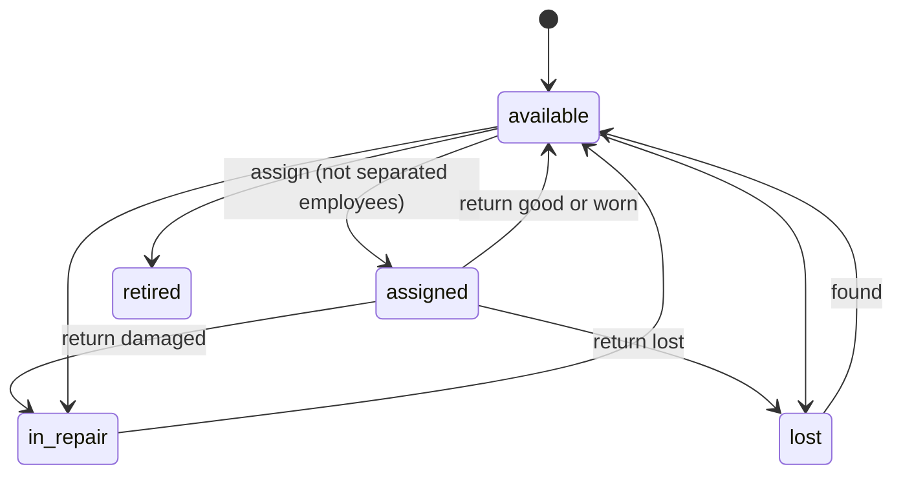
```mermaid
stateDiagram-v2
  [*] --> available
  available --> assigned: assign (not separated employees)
  assigned --> available: return good or worn
  assigned --> in_repair: return damaged
  assigned --> lost: return lost
  available --> in_repair
  in_repair --> available
  available --> retired
  available --> lost
  lost --> available: found
```

## Recruitment and lifecycle (A-29…A-38)

### Requisition
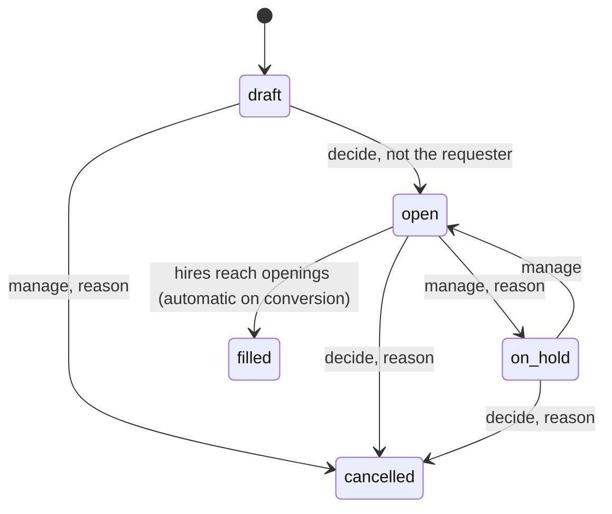
```mermaid
stateDiagram-v2
  [*] --> draft
  draft --> open: decide, not the requester
  draft --> cancelled: manage, reason
  open --> on_hold: manage, reason
  on_hold --> open: manage
  open --> filled: hires reach openings (automatic on conversion)
  open --> cancelled: decide, reason
  on_hold --> cancelled: decide, reason
```

### Application
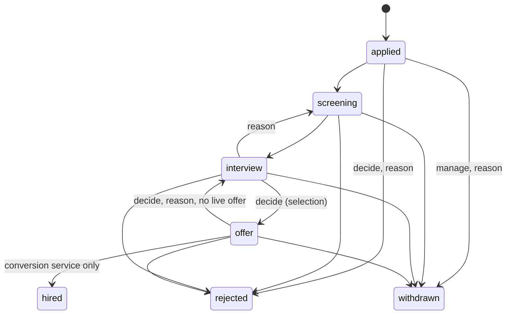
```mermaid
stateDiagram-v2
  [*] --> applied
  applied --> screening
  screening --> interview
  interview --> screening: reason
  interview --> offer: decide (selection)
  offer --> interview: decide, reason, no live offer
  offer --> hired: conversion service only
  applied --> rejected: decide, reason
  screening --> rejected
  interview --> rejected
  offer --> rejected
  applied --> withdrawn: manage, reason
  screening --> withdrawn
  interview --> withdrawn
  offer --> withdrawn
```

### Offer
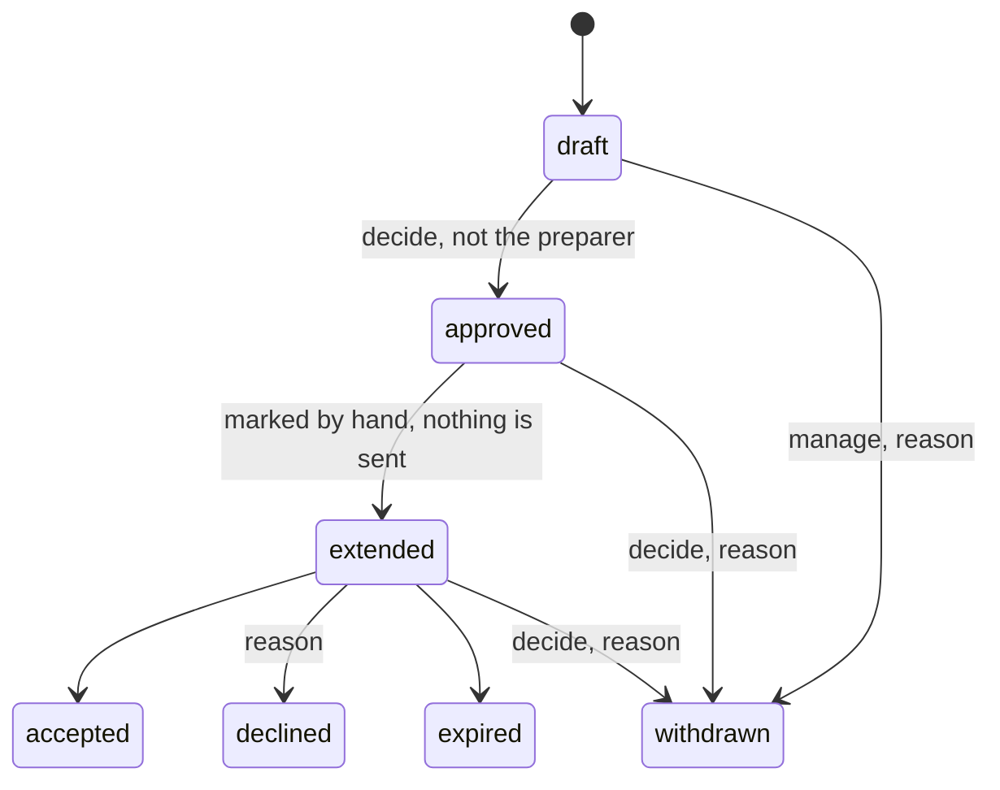
```mermaid
stateDiagram-v2
  [*] --> draft
  draft --> approved: decide, not the preparer
  draft --> withdrawn: manage, reason
  approved --> extended: marked by hand, nothing is sent
  approved --> withdrawn: decide, reason
  extended --> accepted
  extended --> declined: reason
  extended --> withdrawn: decide, reason
  extended --> expired
```

### Interview
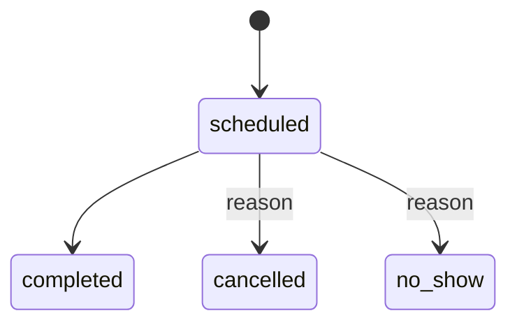
```mermaid
stateDiagram-v2
  [*] --> scheduled
  scheduled --> completed
  scheduled --> cancelled: reason
  scheduled --> no_show: reason
```

### Lifecycle case (onboarding and offboarding)
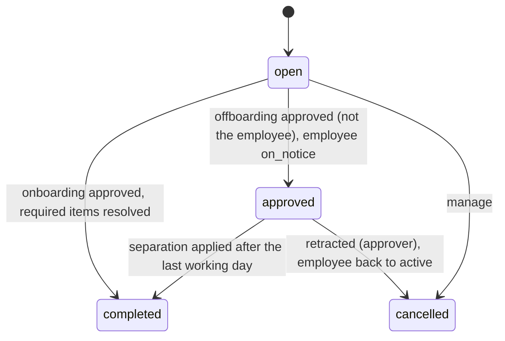
```mermaid
stateDiagram-v2
  [*] --> open
  open --> completed: onboarding approved, required items resolved
  open --> approved: offboarding approved (not the employee), employee on_notice
  approved --> completed: separation applied after the last working day
  approved --> cancelled: retracted (approver), employee back to active
  open --> cancelled: manage
```
Separation sequence: approval puts the employee `on_notice`; the day after the last working day `runSeparations` sets `separated`, the staff row `inactive`, publishes `ops.employee.separated` v1 once in the same transaction; the platform consumer disables the login and deletes sessions; Ops completes the access-revocation item from the delivery.

## HR time (A-39…A-45)

### Attendance session and correction
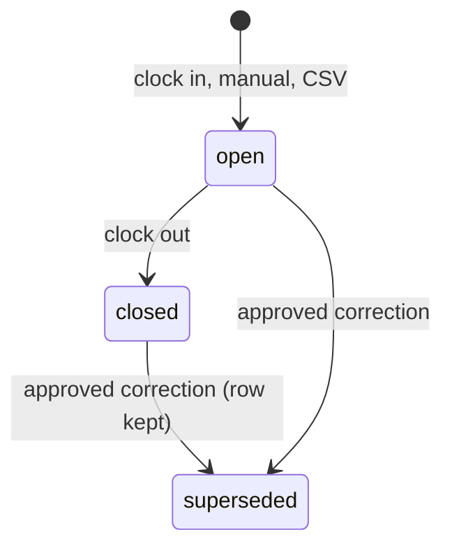
```mermaid
stateDiagram-v2
  [*] --> open: clock in, manual, CSV
  open --> closed: clock out
  closed --> superseded: approved correction (row kept)
  open --> superseded: approved correction
```
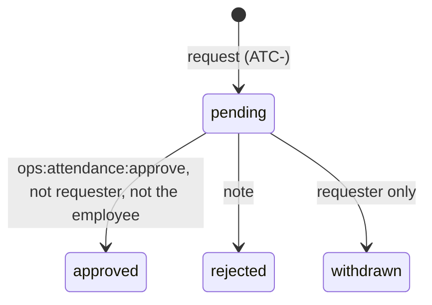
```mermaid
stateDiagram-v2
  [*] --> pending: request (ATC-)
  pending --> approved: ops:attendance:approve, not requester, not the employee
  pending --> rejected: note
  pending --> withdrawn: requester only
```
Approval keeps the original, marks it `superseded` and creates a new `correction` session. A missed day has no original.

### Leave request (A-42, A-43)
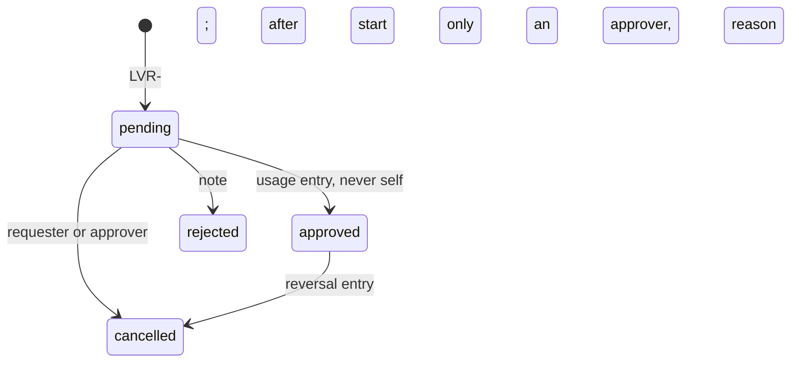
```mermaid
stateDiagram-v2
  [*] --> pending: LVR-
  pending --> approved: usage entry, never self
  pending --> rejected: note
  pending --> cancelled: requester or approver
  approved --> cancelled: reversal entry; after start only an approver, reason
```

### Shift template, leave type and holiday
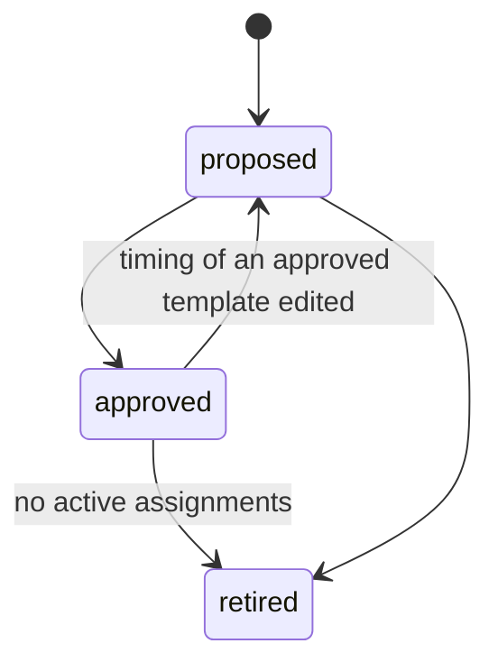
```mermaid
stateDiagram-v2
  [*] --> proposed
  proposed --> approved
  approved --> proposed: timing of an approved template edited
  approved --> retired: no active assignments
  proposed --> retired
```
Holiday: `proposed` and `approved` toggle, either goes to `withdrawn` (final). Shift assignment: `active` ends with an end date or becomes `cancelled` (reason).

## Operations (A-46…A-56)

### Task review (side table, task keeps BR-OPS-10 statuses)
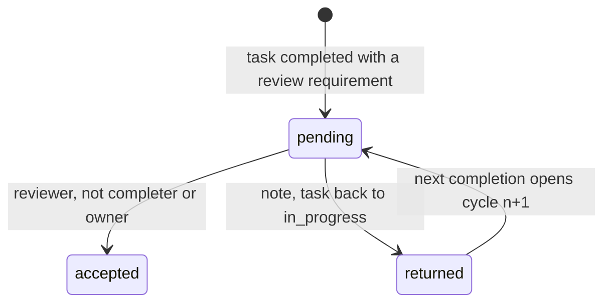
```mermaid
stateDiagram-v2
  [*] --> pending: task completed with a review requirement
  pending --> accepted: reviewer, not completer or owner
  pending --> returned: note, task back to in_progress
  returned --> pending: next completion opens cycle n+1
```
While `pending` the owner cannot reopen the task (409 `REVIEW_PENDING`).

### SOP version, publication and acknowledgement
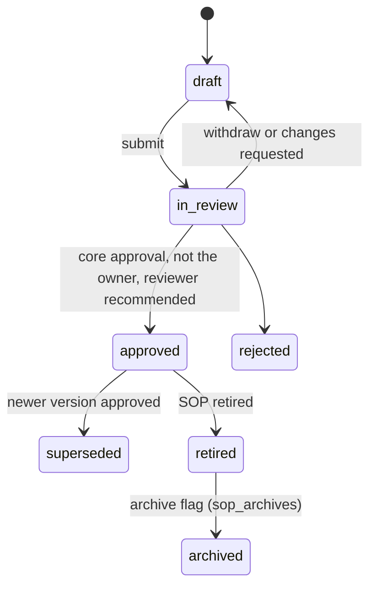
```mermaid
stateDiagram-v2
  [*] --> draft
  draft --> in_review: submit
  in_review --> draft: withdraw or changes requested
  in_review --> approved: core approval, not the owner, reviewer recommended
  in_review --> rejected
  approved --> superseded: newer version approved
  approved --> retired: SOP retired
  retired --> archived: archive flag (sop_archives)
```
Derived, not stored: **Published** = approved version in force with `effective_date` on or before today (IST). Acknowledgements are required per approved version by department or role, append-only, once per person per version.

### Policy version (A-55)
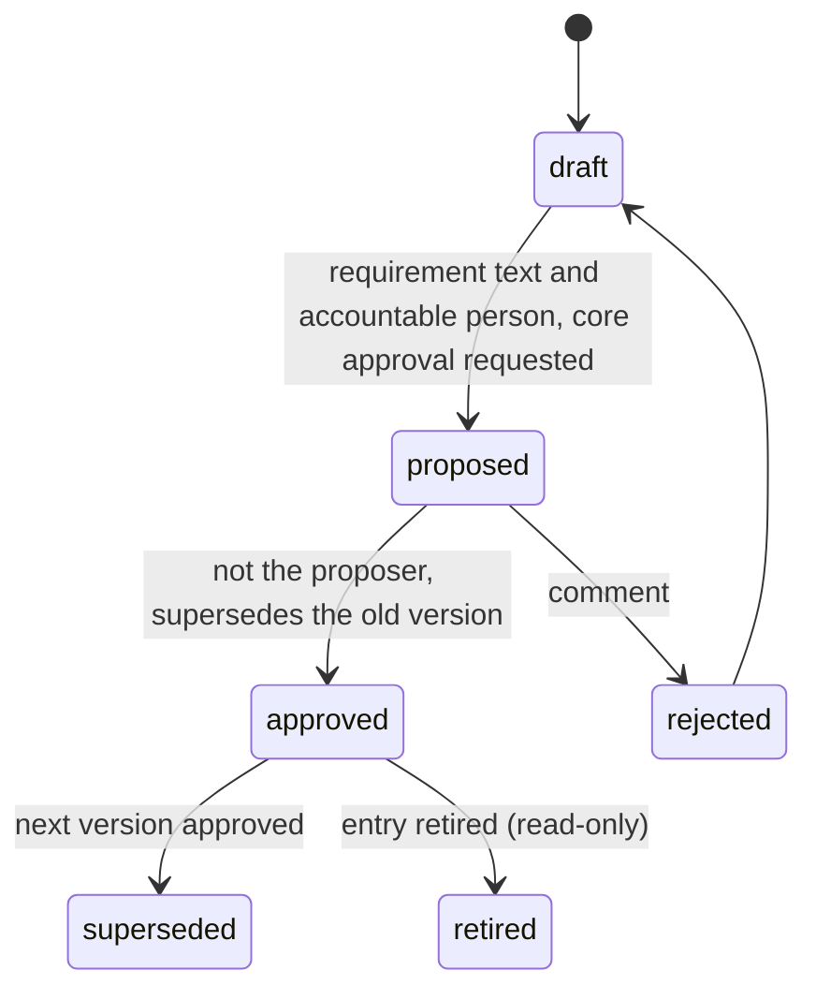
```mermaid
stateDiagram-v2
  [*] --> draft
  draft --> proposed: requirement text and accountable person, core approval requested
  proposed --> approved: not the proposer, supersedes the old version
  proposed --> rejected: comment
  rejected --> draft
  approved --> superseded: next version approved
  approved --> retired: entry retired (read-only)
```
An approved entry stays `approved` while a newer version is drafted or proposed.

### Risk mitigation
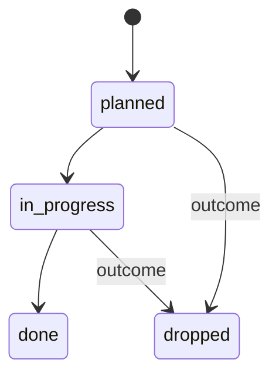
```mermaid
stateDiagram-v2
  [*] --> planned
  planned --> in_progress
  in_progress --> done
  planned --> dropped: outcome
  in_progress --> dropped: outcome
```
